# snake-and-commits

Your GitHub contribution graph, but it's a real game of Snake.



The snake plays an actual, winnable game. It hunts every commit cell with real
pathfinding, never crosses its own body, grows one segment per cell it eats,
fades from a bright head to a dim tail, and counts the commits it swallows. Pure
animated SVG (CSS, no JavaScript), so it renders anywhere GitHub shows an image.

- Real Snake AI: BFS pathfinding, self-collision avoidance, tail-chasing when boxed in
- Eats your commits: each contribution cell is food, with a live counter
- Grows as it eats: starts at 3 segments, gains one per cell, head-to-tail gradient
- Themeable: `green` (default), `blue`, `amber`, `matrix`
- Zero dependencies: one standard-library Python file
- Respects `prefers-reduced-motion`: falls back to a static graph

## Quickstart

Add one workflow to your profile repo (the repo named after your username).
Create `.github/workflows/snake.yml`:

```yaml
name: snake
on:
  schedule:
    - cron: "0 */12 * * *"   # twice a day
  workflow_dispatch:
permissions:
  contents: write
jobs:
  build:
    runs-on: ubuntu-latest
    steps:
      - uses: dahan8473/snake-and-commits@v1
        with:
          github_user: ${{ github.repository_owner }}
          output: dist/snake.svg
          theme: green
      - uses: crazy-max/ghaction-github-pages@v4
        with:
          target_branch: output
          build_dir: dist
        env:
          GITHUB_TOKEN: ${{ github.token }}
```

Run it once from the Actions tab, then add this to your `README.md`:

```md

```

It regenerates on schedule from your live contribution data.

### Light and dark

Generate two themes and switch with `<picture>`:

```md
<picture>
  <source media="(prefers-color-scheme: dark)"  srcset=".../output/snake-dark.svg">
  <source media="(prefers-color-scheme: light)" srcset=".../output/snake-light.svg">
  
</picture>
```

## Options

| input | default | description |
|---|---|---|
| `github_user` | required | whose graph to render (usually `${{ github.repository_owner }}`) |
| `output` | `dist/snake.svg` | output path |
| `theme` | `green` | `green`, `blue`, `amber`, `matrix` |
| `frame` | `false` | draw a rounded window frame around the graph |
| `counter` | `true` | show the `commits eaten: n/total` counter |

## Themes

`green` is the native GitHub look. `blue` is a phosphor terminal. `amber` is an
old CRT. `matrix` is bright-on-black.

## Run locally

```bash
GH_TOKEN=$(gh auth token) python3 generate.py --user YOUR_NAME --output snake.svg --theme green
```

One file, standard library only. Any token that can read public contribution
data works.

## How it works

1. Pull a year of contribution levels from the GitHub GraphQL API.
2. Solve the board like a Snake game. From a corner, BFS to the nearest commit
   cell (sparsest first), always avoiding the body. If the best target is walled
   off, chase the tail until space opens. The route is collision-free, and the
   max length is auto-tuned to the largest snake that still clears the board.
3. Render it as a cell-state animation. Each grid square animates its own fill:
   bright when the head enters, fading down the body, back to background as the
   tail passes. Nothing moves, so segments can never overlap.

## Credits

Built by [David Liu](https://github.com/dahan8473). Inspired by the
contribution-graph art tradition ([Platane/snk](https://github.com/Platane/snk)
and friends), rebuilt from scratch as an actual game of Snake. MIT licensed.
